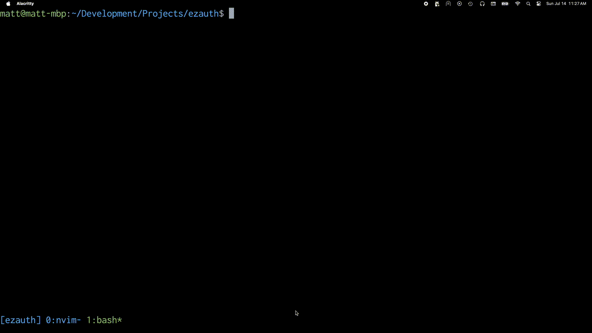

# Warning
This project is still in an idea phase.

# Goal
Make it trivial to add user auth to a Go HTTP app with complete HTML templates, using any `*sql.DB` compliant database as the storage mechanism.

Rolling one's own auth is a risk vector and a distraction from implementing business logic. Offloading auth onto an external provider is an additional cost, adds the latency of a network hop, and removes full control over one's application.

An importable package can solve these problems, and this is what `ezauth` intends to do.

# Sponsor
I will be creating this package over the next few weeks or months, but am currently bottlenecked by a full time job which consumes most my time, energy, and focus.

If sponsors could cover my monthly expenses, I could channel all my energy to making this the best it could be in a more timely manner.

This package could greatly benefit myself, indie developers, and enterprises alike.

# Demo


# Sample
```go
func main() {
	mux := http.NewServeMux()
	cfg := ezauth.Config{
		DB: db,
		// override default templates
		// add configured oauth providers
		// ...
	}
	auth, err := ezauth.NewAuth(cfg)
	auth.RegisterRoutes(mux)
	mux.Handle("/profile", auth.SessionMiddleware(http.HandlerFunc(func(w http.ResponseWriter, r *http.Request) {
		tmpl := template.Must(template.New("").ParseFiles("internal/profile.html"))
		tmpl.ExecuteTemplate(w, "profile.html", nil)
	})))
	fmt.Println("Listening on :8080")
	if err := http.ListenAndServe(":8080", mux); err != nil {
		panic(err)
	}
}
```

# Motivation
Basic bcrypt auth isn't that hard to learn for a Go `net/http` web app. Its true, but online forums are littered with desparate cries for a [django-allauth](https://docs.allauth.org/en/latest/) equivalent in the Go ecosystem, which doesn't exist (in a way that is trivial to incorporate). These cries either come from beginners, or from time conscious individuals uninterested in reinventing wheels. Both are valid.

The basic requirements are to handle the basic auth flows with email/pass (and probably OAuth), against a `database/sql` compliant database connection.

This compliance is important, because this means it should support different databases. SQLite and Postgres have their strengths, its nice to be able to choose.

Most importantly, it should be trivial to incorporate. Just import the package, add the route group, and instantly access premade HTML pages which interact with `ezauth` routes via forms. These pages can be overridden for aesthetics, but adding functional auth to a `net/http` web app should take minutes, not hours or days.

The goal is not to create a comprehensive and advanced auth library, but to make it trivial to incorporate the common use case of "adding login to my Go web app".

Reluctantly, I made the decision to implement auth fitting this description. By creating a public package, I can import future fixes into my disjoint projects, open the global community to make security suggestions, and help someone in the future get started more quickly.
